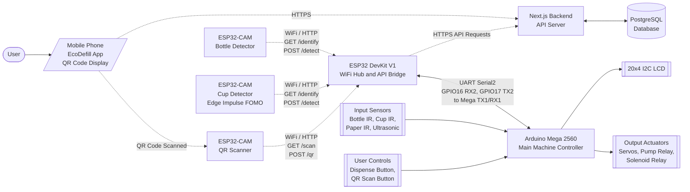

# EcoDefill v3 Hardware Setup Guide

This document matches the current firmware in `hardware/`:

- Arduino Mega 2560 runs the local machine state logic
- ESP32 DevKit V1 is the Wi-Fi bridge and backend API client
- 3 ESP32-CAM boards communicate with the DevKit over Wi-Fi only

The cameras do not connect directly to the Mega by serial in this version.

## 1. System Architecture

```text
Bottle/Cup/QR ESP32-CAMs <---- Wi-Fi ----> ESP32 DevKit <---- UART ----> Arduino Mega
                                                     |
                                                     +---- HTTPS ----> eco-defill.vercel.app
```

### Block Diagram

Use this block diagram for the system architecture section of the thesis. Rectangles represent hardware or software modules, the cylinder represents the database, solid arrows represent wired connections, and dashed arrows represent wireless or network communication.



For a thesis figure, keep this as a block diagram rather than a full wiring schematic. The detailed pin-level connections are listed in the following sections.

## 2. Board Roles

| Board | Qty | Role |
|:------|:---:|:-----|
| Arduino Mega 2560 | 1 | Main state machine, LCD, buttons, IR sensors, servos, relays |
| ESP32 DevKit V1 | 1 | Local HTTP server, QR/API bridge, UART bridge to Mega |
| ESP32-CAM Bottle | 1 | Bottle detection |
| ESP32-CAM Cup | 1 | Cup detection |
| ESP32-CAM Scanner | 1 | QR scanning |

## 3. Network Requirements

All ESP32 boards must connect to the same 2.4 GHz Wi-Fi network or phone hotspot.

Current firmware expects this subnet:

| Device | Static IP |
|:-------|:----------|
| ESP32 DevKit | `192.168.100.100` |
| Bottle CAM | `192.168.100.110` |
| Cup CAM | `192.168.100.111` |
| QR CAM | `192.168.100.120` |
| Gateway | `192.168.100.1` |
| Subnet mask | `255.255.255.0` |

Requirements:

- All four ESP32 sketches must use the same `WIFI_SSID` and `WIFI_PASSWORD`
- The hotspot/router must actually use the `192.168.100.x` subnet, or you must update all four sketches
- AP/client isolation must be disabled so local devices can reach each other
- Internet access is needed for the DevKit when calling the backend APIs

## 4. UART Wiring Between Mega and DevKit

This is the only required serial connection in the current design.

| Mega | ESP32 DevKit | Notes |
|:-----|:-------------|:------|
| TX1 pin `18` | GPIO`16` (RX2) | Use a voltage divider, Mega is 5V and ESP32 RX is 3.3V |
| RX1 pin `19` | GPIO`17` (TX2) | Direct connection is acceptable |
| GND | GND | Common ground required |

Voltage divider for Mega TX1 -> ESP32 RX2:

```text
Mega TX1 ---[1k]---+--- ESP32 GPIO16
                   |
                  [2k]
                   |
                  GND
```

## 5. Mega Pin Map

These connections match the current `arduino_mega_controller/arduino_mega_controller.ino` firmware.

### Servos

| Component | Mega Signal Pin | Power | Ground | Notes |
|:----------|:----------------|:------|:-------|:------|
| Bottle gate servo | D`5` | External 6V servo rail | Common GND | Signal only goes to Mega; do not power servo from Mega 5V |
| Bottle exit servo | D`6` | External 6V servo rail | Common GND | MG996R/MG90 style servo signal |
| Bottle bin/sorter servo | D`3` | External 6V servo rail | Common GND | Current firmware uses pin `3`, not pin `7` |
| Cup gate servo | D`8` | External 6V servo rail | Common GND | Signal only goes to Mega |
| Cup exit servo | D`9` | External 6V servo rail | Common GND | Signal only goes to Mega |
| Cup bin/sorter servo | D`10` | External 6V servo rail | Common GND | Signal only goes to Mega |

### IR Sensors

| Component | Mega Signal Pin | Power | Ground | Firmware Mode | Notes |
|:----------|:----------------|:------|:-------|:--------------|:------|
| Bottle slot IR sensor | D`22` | 5V logic rail | Common GND | `INPUT_PULLUP` | Active LOW |
| Bottle chamber/valid IR sensor | D`23` | 5V logic rail | Common GND | `INPUT_PULLUP` | Active LOW |
| Cup slot IR sensor | D`24` | 5V logic rail | Common GND | `INPUT_PULLUP` | Active LOW |
| Cup chamber/valid IR sensor | D`25` | 5V logic rail | Common GND | `INPUT_PULLUP` | Active LOW |
| Paper entry IR sensor | D`26` | 5V logic rail | Common GND | `INPUT_PULLUP` | Active LOW |

### Buttons

The current firmware expects 3-pin button modules where the signal is LOW when released and HIGH when pressed.

| Component | Mega Signal Pin | Power | Ground | Notes |
|:----------|:----------------|:------|:-------|:------|
| Dispense button | D`30` | 5V logic rail | Common GND | Button `S/OUT` pin to D30 |
| QR scan button | D`31` | 5V logic rail | Common GND | Button `S/OUT` pin to D31 |

### Ultrasonic Sensor

| Component | Mega Pin | Sensor Pin | Power | Ground | Notes |
|:----------|:---------|:-----------|:------|:-------|:------|
| Ultrasonic trigger | D`32` | TRIG | 5V logic rail | Common GND | Output from Mega |
| Ultrasonic echo | D`33` | ECHO | 5V logic rail | Common GND | Input to Mega |

### Relays and Water Dispensing Loads

| Component | Mega Signal Pin | Relay Module Power | Load Power | Notes |
|:----------|:----------------|:-------------------|:-----------|:------|
| Pump relay | D`34` | 5V logic rail | External pump supply | Firmware treats pump relay as active LOW |
| Solenoid 1 relay | D`36` | 5V logic rail | External solenoid supply | Firmware treats solenoid relay as active HIGH |

Relay module GND, Mega GND, ESP32 DevKit GND, and external supply GND must be common. Keep the pump and solenoid load supply separate from the Mega logic rail.

### LCD 20x4 I2C

| LCD I2C Pin | Arduino Mega Pin | Notes |
|:------------|:-----------------|:------|
| SDA | D`20` / SDA | I2C data |
| SCL | D`21` / SCL | I2C clock |
| VCC | 5V logic rail | LCD address in firmware is `0x27` |
| GND | Common GND | Required |

## 6. ESP32 DevKit V1 Pin Connections

| DevKit Pin | Connected To | Notes |
|:-----------|:-------------|:------|
| GPIO`16` RX2 | Arduino Mega TX1 D`18` | Use 1k/2k voltage divider from Mega TX to ESP32 RX |
| GPIO`17` TX2 | Arduino Mega RX1 D`19` | Direct signal connection |
| GPIO`2` | Built-in LED | Used by firmware as status LED |
| 5V/VIN | 5V logic rail or USB | DevKit is powered by 5V |
| GND | Common GND | Must be shared with Mega and relay/sensor logic |

The ESP32 DevKit does not use wired connections to the ESP32-CAM boards. It communicates with them through Wi-Fi/HTTP.

## 7. ESP32-CAM Pin Connections

The Bottle CAM, Cup CAM, and QR CAM are AI Thinker ESP32-CAM boards. In the current design, they only need power and Wi-Fi. They do not connect to the Arduino Mega through UART, GPIO, or I2C.

### External Connections

| ESP32-CAM Pin | Connected To | Notes |
|:--------------|:-------------|:------|
| 5V | Stable 5V camera rail | Use a supply that can handle camera current spikes |
| GND | Common GND | Recommended common reference for the whole machine |
| Wi-Fi | Same 2.4 GHz network as DevKit | Wireless HTTP communication |
| U0R/U0T/GPIO0 | Programming adapter only | Used during upload, not normal machine operation |

### AI Thinker Camera Internal Pin Map

These are internal board-to-camera connections used by the firmware. They are useful for documentation, but you normally do not wire these manually.

| Camera Signal | ESP32 GPIO |
|:--------------|:-----------|
| PWDN | GPIO`32` |
| RESET | Not connected / `-1` |
| XCLK | GPIO`0` |
| SIOD / SCCB SDA | GPIO`26` |
| SIOC / SCCB SCL | GPIO`27` |
| Y9 / D7 | GPIO`35` |
| Y8 / D6 | GPIO`34` |
| Y7 / D5 | GPIO`39` |
| Y6 / D4 | GPIO`36` |
| Y5 / D3 | GPIO`21` |
| Y4 / D2 | GPIO`19` |
| Y3 / D1 | GPIO`18` |
| Y2 / D0 | GPIO`5` |
| VSYNC | GPIO`25` |
| HREF | GPIO`23` |
| PCLK | GPIO`22` |
| On-board status/flash LED used in sketches | GPIO`33` |

## 8. Complete Hardware Connection Summary

| Hardware Component | Controller | Signal Pin(s) | Connection Type |
|:-------------------|:-----------|:--------------|:----------------|
| Bottle gate servo | Arduino Mega | D`5` | Wired PWM servo signal |
| Bottle exit servo | Arduino Mega | D`6` | Wired PWM servo signal |
| Bottle bin/sorter servo | Arduino Mega | D`3` | Wired PWM servo signal |
| Cup gate servo | Arduino Mega | D`8` | Wired PWM servo signal |
| Cup exit servo | Arduino Mega | D`9` | Wired PWM servo signal |
| Cup bin/sorter servo | Arduino Mega | D`10` | Wired PWM servo signal |
| Bottle slot IR | Arduino Mega | D`22` | Wired digital input |
| Bottle chamber IR | Arduino Mega | D`23` | Wired digital input |
| Cup slot IR | Arduino Mega | D`24` | Wired digital input |
| Cup chamber IR | Arduino Mega | D`25` | Wired digital input |
| Paper entry IR | Arduino Mega | D`26` | Wired digital input |
| Dispense button | Arduino Mega | D`30` | Wired digital input |
| QR scan button | Arduino Mega | D`31` | Wired digital input |
| Ultrasonic sensor | Arduino Mega | D`32` TRIG, D`33` ECHO | Wired digital I/O |
| Pump relay | Arduino Mega | D`34` | Wired digital output |
| Solenoid 1 relay | Arduino Mega | D`36` | Wired digital output |
| 20x4 I2C LCD | Arduino Mega | D`20` SDA, D`21` SCL | Wired I2C |
| ESP32 DevKit UART | Arduino Mega | D`18` TX1, D`19` RX1 | Wired UART |
| Arduino Mega UART | ESP32 DevKit | GPIO`16` RX2, GPIO`17` TX2 | Wired UART |
| Bottle ESP32-CAM | ESP32 DevKit | Wi-Fi / HTTP | Wireless |
| Cup ESP32-CAM | ESP32 DevKit | Wi-Fi / HTTP | Wireless |
| QR ESP32-CAM | ESP32 DevKit | Wi-Fi / HTTP | Wireless |
| Backend server | ESP32 DevKit | HTTPS | Wireless network/internet |

## 9. Schematic Diagram Description

The schematic diagram shows the physical wiring and communication paths of the EcoDefill v3 hardware system. The Arduino Mega 2560 serves as the main controller for the machine-side components, including the IR sensors, ultrasonic sensor, push buttons, I2C LCD, servo motors, pump relay, and solenoid relay. These components are connected to the Mega through wired GPIO, PWM, and I2C connections.

The ESP32 DevKit V1 is connected to the Arduino Mega through UART serial communication. The Mega TX1 pin `18` is connected to the ESP32 DevKit GPIO`16` RX2 through a voltage divider because the Mega uses 5V logic while the ESP32 uses 3.3V logic. The ESP32 DevKit GPIO`17` TX2 is connected directly to the Mega RX1 pin `19`. Both boards share a common ground to ensure stable serial communication.

The ESP32-CAM modules for bottle detection, cup detection, and QR scanning are not wired directly to the Arduino Mega. They are powered separately through a stable 5V camera rail and communicate with the ESP32 DevKit wirelessly over Wi-Fi using HTTP requests. In the schematic or system diagram, these camera connections should be represented using dashed lines to indicate wireless communication.

The power system is separated into different supply rails to improve stability. The servo motors use a high-current 6V supply, the logic components use a regulated 5V supply, the ESP32-CAM boards use a stable 5V camera supply, and the pump or solenoid loads use their required external load supply. All grounds must be connected together to provide a common electrical reference.

In the schematic diagram, solid lines represent physical wired connections such as power, ground, UART, I2C, GPIO, PWM, and relay control. Dashed lines represent wireless communication such as Wi-Fi, HTTP, and HTTPS.

Suggested figure caption:

> Figure X. Schematic diagram of the EcoDefill v3 hardware system showing the Arduino Mega 2560 as the main controller, the ESP32 DevKit V1 as the Wi-Fi and API bridge, and the ESP32-CAM modules as wireless image and QR recognition devices. Solid lines indicate physical electrical connections, while dashed lines indicate wireless communication.

## 10. Power Requirements

Recommended power layout:

| Rail | Suggested Load |
|:-----|:---------------|
| 6V high-current rail | MG996R servos |
| 5V logic rail | Mega, ESP32 DevKit, LCD, sensors |
| 5V camera rail | 3x ESP32-CAM modules |
| 12V load rail | Pump and solenoid |

Notes:

- ESP32-CAM boards are sensitive to voltage sag; give them a stable 5V supply
- All grounds must be common
- Relays driving inductive loads should use flyback protection if not already built into the modules
- Avoid moving too many servos at once on a weak supply

## 11. Firmware Files

| File | Target Board |
|:-----|:-------------|
| `arduino_mega_controller/arduino_mega_controller.ino` | Arduino Mega 2560 |
| `esp32_main_controller/esp32_main_controller.ino` | ESP32 DevKit V1 |
| `esp32_cam_bottle/esp32_cam_bottle.ino` | AI Thinker ESP32-CAM |
| `esp32_cam_cup/esp32_cam_cup.ino` | AI Thinker ESP32-CAM |
| `esp32_cam_scanner/esp32_cam_scanner.ino` | AI Thinker ESP32-CAM |

Before uploading, verify:

- Wi-Fi SSID and password match in all ESP32 sketches
- `MACHINE_ID` is correct in the DevKit sketch
- Static IPs match across the DevKit and all CAM sketches

## 12. HTTP and UART Protocol

### Mega -> DevKit over UART

| Message | Meaning |
|:--------|:--------|
| `CMD:IDENTIFY_BOTTLE` | Trigger bottle CAM |
| `CMD:IDENTIFY_CUP` | Trigger cup CAM |
| `CMD:SCAN_QR` | Start QR scan mode |
| `CMD:CANCEL_QR` | Cancel QR scan mode |
| `CMD:EARN_ANON|BOTTLE|2` | Log anonymous bottle earn |
| `CMD:EARN_ANON|CUP|1` | Log anonymous cup earn |

### DevKit -> Mega over UART

| Message | Meaning |
|:--------|:--------|
| `CAM:BOTTLE:VALID` | Bottle accepted |
| `CAM:BOTTLE:INVALID` | Bottle rejected |
| `CAM:CUP:VALID` | Cup accepted |
| `CAM:CUP:INVALID` | Cup rejected |
| `QR:FOUND` | QR code detected and backend verification is starting |
| `QR:RECEIVE:<pts>\|<name>` | QR converted local machine points into app credit |
| `QR:REDEEM:<ms>\|<name>\|<pts>` | QR approved water dispense time |
| `QR:FAIL` | QR rejected or request failed |

### DevKit Local HTTP Server

| Endpoint | Used By | Purpose |
|:---------|:--------|:--------|
| `POST /detect` | Bottle/Cup CAMs | Send item detection result |
| `POST /qr` | QR CAM | Send scanned QR token |
| `GET /ping` | Any CAM | Connectivity check |

### CAM HTTP Endpoints

| Device | Endpoint | Purpose |
|:-------|:---------|:--------|
| Bottle CAM | `GET /identify` | Capture and classify bottle |
| Cup CAM | `GET /identify` | Capture and classify cup |
| QR CAM | `GET /scan` | Start scanning |
| QR CAM | `GET /cancel` | Stop scanning |
| All CAMs | `GET /ping` | Connectivity check |

## 13. Expected Runtime Flow

The system operates using a combined mechanical and point-logic state machine. 

### ♻️ 1. Item Recycling & Mechanical Flow
1. **Insertion:** A user inserts an item into the slot. **IR 1 (Slot IR Sensor)** detects the object. 
   * *Safety Check:* The Arduino Mega verifies **IR 2 (Chamber IR Sensor)**. If the chamber is busy (validating another object), the slot stays locked.
2. **Entering the Chamber:** If clear, **Servo 1 (Gate Servo)** opens, allowing the item to drop, and immediately closes to lock out new items.
3. **Detection:** The item lands and blocks **IR 2 (Chamber IR Sensor)**. The Mega sends `CMD:IDENTIFY_BOTTLE` (or CUP) to the ESP32 DevKit.
4. **Validation:** The DevKit calls the ESP32-CAM via Wi-Fi. The camera runs its Edge Impulse shape validation and returns the result to the DevKit, which sends it back to the Mega.
5. **Sorting:**
   * **If Valid:** **Servo 3 (Bin/Sorter Servo)** moves to the "Accept" position. Then **Servo 2 (Exit Servo)** opens to drop the item into the accepted bin. Points are awarded.
   * **If Invalid:** **Servo 3 (Bin/Sorter Servo)** stays in the default "Reject" position. **Servo 2 (Exit Servo)** opens to drop the garbage into the reject bin. No points awarded.
6. **Reset:** **Servo 2** closes, and the machine is ready for the next item.

### 💯 2. Earning Points (Local Machine State)
*   **Point Values:** 1 Valid Bottle = 1 Point, 1 Valid Cup = 1 Point, 3 Valid Papers = 1 Point. 
*   **Display & Limit:** The 20x4 I2C LCD displays the accumulated points. The machine holds a maximum of **5 local points**. Once reached, the user must dispense water or save points to their app before recycling more.

### 💧 3. The Blue Button (Water Dispense)
Used to exchange locally earned points for physical water.
1. User accumulates local points (e.g., `Local Points: 2`).
2. User places a container under the nozzle and presses the **Blue Button**.
3. If points > 0, the Mega activates the **Pump Relay** and **Solenoid Relay** for a duration proportional to the points. 
4. The LCD displays `Dispensing Water...`. When finished, local points reset to `0`.

### 📱 4. The Red Button (QR Scanner / App Integration)
Used to either save local points to the app, or redeem points from the app for water.
*   **Scenario A: Saving Points (Condition: Local Points > 0)**
    1. User has local points and presses the **Red Button**. LCD says `Present QR to Scanner`.
    2. User shows their personal app QR code to the QR ESP32-CAM. 
    3. The DevKit verifies the user with the backend (`eco-defill.vercel.app`) and credits their account (`QR:RECEIVE...`).
    4. LCD confirms the saved points, and local machine points reset to `0`.
*   **Scenario B: Redeeming Points (Condition: Local Points = 0)**
    1. User walks up to an empty machine, generates a "Redeem Water" QR code on their app, and presses the **Red Button**. LCD says `Present QR to Scanner`.
    2. The QR CAM scans the code. The DevKit verifies the redemption token with the backend.
    3. DevKit commands the Mega to dispense water (`QR:REDEEM...`).
    4. LCD displays `Redeemed! Dispensing...` and the water is dispensed.

## 14. Bring-Up Checklist

- Flash all five boards with the matching firmware in this folder
- Confirm all ESP32 boards boot and join the same Wi-Fi network
- Confirm DevKit is reachable at `192.168.100.100`
- Confirm Bottle CAM responds at `http://192.168.100.110/ping`
- Confirm Cup CAM responds at `http://192.168.100.111/ping`
- Confirm QR CAM responds at `http://192.168.100.120/ping`
- Confirm Mega and DevKit share ground
- Confirm Mega `Serial1` and DevKit `Serial2` baud rate are both `9600`
- Confirm the voltage divider is present on Mega TX1 -> DevKit RX2
- Confirm backend URLs are reachable from the DevKit

## 15. Troubleshooting

| Problem | Check |
|:--------|:------|
| DevKit cannot trigger CAMs | Wrong SSID/password, wrong static IP, client isolation enabled |
| CAM posts fail | `DEVKIT_IP` mismatch or DevKit not on the network |
| Mega never receives result | UART wiring wrong, no common ground, missing voltage divider, wrong baud |
| QR always fails | No internet on DevKit, backend token invalid, QR posted while scan mode inactive |
| CAMs reboot during capture | Weak 5V supply to ESP32-CAM |
| Detection always returns invalid | Lighting or thresholds need tuning |
| LCD is blank | Check I2C address, power, SDA/SCL wiring |
