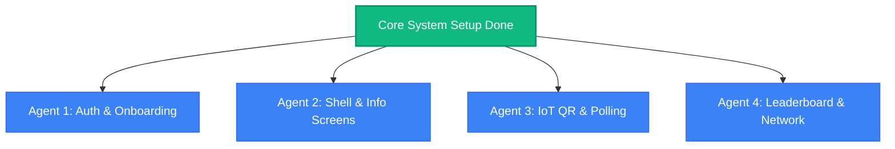

# EcoDefill: Parallel Agent Task Assignments

To accelerate development using multiple **Gemini 3.5 Flash** agents, the remaining work is divided into **4 self-contained developer roles**. Each role has clear API inputs, directory boundaries, and mock file expectations to prevent collision.

---

---

## 🔑 Agent 1: Auth & User Onboarding Agent
*   **Objective**: Build register, code request, and reset password flows.
*   **Directory Scope**: `lib/features/auth/`
*   **API Integrations**:
    *   `POST /api/auth/request-verification-code`
    *   `POST /api/auth/register`
    *   `POST /api/auth/reset-password`
*   **Tasks**:
    1.  Create `lib/features/auth/screens/register_screen.dart`. Include standard form controls plus dropdowns for `course` (BSIT, BSCS, BSHM, BSTM, BECED, BTLED, BSOAD) and `yearLevel` (1st, 2nd, 3rd, 4th Year).
    2.  Create `lib/features/auth/screens/forgot_password_screen.dart` and `lib/features/auth/screens/reset_password_screen.dart`.
    3.  Create state controllers or Riverpod structures in `lib/features/auth/providers/auth_provider.dart` to make API calls using the `ApiClient.instance.post` client and show loading states/toasts.

---

## 🧭 Agent 2: Navigation Shell & Information Screens Agent
*   **Objective**: Build the page shell and secondary info screens.
*   **Directory Scope**: `lib/features/shell/` and various `lib/features/*/` info screens.
*   **API Integrations**:
    *   `GET /api/user-transactions` (for transaction history logs)
*   **Tasks**:
    1.  Create `lib/features/shell/screens/shell_layout.dart` that implements a `BottomNavigationBar` (Home, Rewards, History, Ranking, Profile).
    2.  Create `lib/features/rewards/screens/rewards_guide_screen.dart` (replicates `/rewards/page.tsx` displaying rates and water volume maps).
    3.  Create `lib/features/history/screens/history_screen.dart` displaying a detailed grouped transaction feed (grouped by date) and summary stats cards (Total Earned, Total Redeemed).
    4.  Create `lib/features/profile/screens/profile_screen.dart` displaying student information, class metadata, and the logout action button.

---

## 🛜 Agent 3: IoT Interactive Flows Agent (QR & Polling)
*   **Objective**: Build the live QR generating and backend status-polling routines.
*   **Directory Scope**: `lib/features/qr/` and `lib/features/redeem/`
*   **API Integrations**:
    *   `POST /api/qr-generate` (Earn Token generation)
    *   `POST /api/redeem-initiate` (Redeem Token generation)
    *   `GET /api/qr-status?token=<token>` (Live status polling)
*   **Tasks**:
    1.  Create `lib/features/qr/screens/receive_points_screen.dart`. Calls `/api/qr-generate` to fetch the token, displays it as a vector QR using `qr_flutter`, starts a 2-second periodic timer polling `/api/qr-status?token=...`, and redirects to the Dashboard with a success dialog on `used: true`.
    2.  Create `lib/features/redeem/screens/redeem_water_screen.dart`. Features points selector (+ / - counter, up to 5 points), calls `/api/redeem-initiate`, renders the redemption QR popup, and polls the token status.

---

## 🏆 Agent 4: Leaderboard & Connectivity Agent
*   **Objective**: Build standings leaderboard and global network observers.
*   **Directory Scope**: `lib/features/ranking/` and `lib/core/network/`
*   **API Integrations**:
    *   `GET /api/course-ranking`
*   **Tasks**:
    1.  Create `lib/features/ranking/screens/ranking_screen.dart` to fetch the current course statistics, draw a clean ranked leaderboard with gold/silver/bronze icons, and cache outcomes in `LocalCache`.
    2.  Implement a global banner/toast notification in `lib/main.dart` or a base wrapper widget using `connectivity_plus` to monitor internet status. Alert the user if they go offline and load Hive caches instead of failing network calls.
